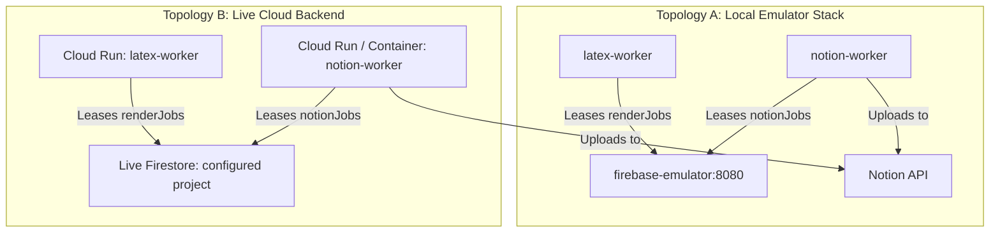

# Cloud Infrastructure & Deployment Architecture

The **Deployment Subsystem** (`deploy/`) provides containerization, security policies, and deployment blueprints for running background workers on local emulators, Docker Compose, or Google Cloud (Cloud Run / Firestore).

---

## 1. Deployment Topologies



---

## 2. Directory Structure

```
deploy/
├── docker/
│   ├── firebase-emulator/Dockerfile   # Google Cloud Firestore emulator runtime
│   ├── latex-worker/Dockerfile        # TeXLive XeLaTeX compiler container
│   ├── notion-worker/Dockerfile       # Notion queue daemon container
│   └── playwright-worker/Dockerfile   # Headless Playwright Chromium submission worker
│
├── pwa/                               # Authenticated, review-only Web App (Firebase Hosting)
│   ├── index.html                     # Responsive authenticated review UI
│   ├── app.js                         # Authenticated read-only Firestore listener
│   └── manifest.json                  # PWA Home-Screen installation manifest
│
├── firestore/
│   ├── firestore.rules                # Database access rules & tenant isolation
│   └── firestore.indexes.json         # Composite indexes for queues & leases
│
├── compose.yaml                       # Local standalone development stack
└── compose.live.yaml                  # Live Firebase connected deployment (Latex, Notion, Playwright)

```

---

## 3. Security Rules & Indexing Specifications

### Firestore Security Boundary (`firestore.rules`):
1. **User Isolation**:
   ```javascript
   match /users/{userId}/{allPaths=**} {
     allow read, write: if request.auth != null && request.auth.uid == userId;
   }
   ```
2. **Server Queue Lockdown**:
   ```javascript
   match /notionJobs/{jobId} {
     allow read, write: if false; // Server / Admin SDK only
   }
   match /renderJobs/{jobId} {
     allow read, write: if false; // Server / Admin SDK only
   }
   ```

3. **Submission safety**: `submissionJobs` and `automationIncidents` are
   server-only. The auto-apply worker is locked unless the deployment
   explicitly sets `JAA_ENABLE_SUBMISSION=I_UNDERSTAND_SUBMISSION`; the local
   CLI additionally requires `--allow-submit` and interactive confirmation.
   Normal application preparation never invokes this path.

4. **PWA boundary**: the review client requires Firebase Authentication and
   derives the user ID from the signed-in Firebase user. It has no hard-coded
   user ID, no Notion token, and no client-side path to create approval or
   submission jobs.

### Composite Indexes (`firestore.indexes.json`):
- `notionJobs`: `(state ASC, created_at ASC)` for FIFO queue ordering.
- `notionJobs`: `(state ASC, lease_expires_at ASC)` for expired lease recycling.
- `renderJobs`: `(state ASC, created_at ASC)`.
