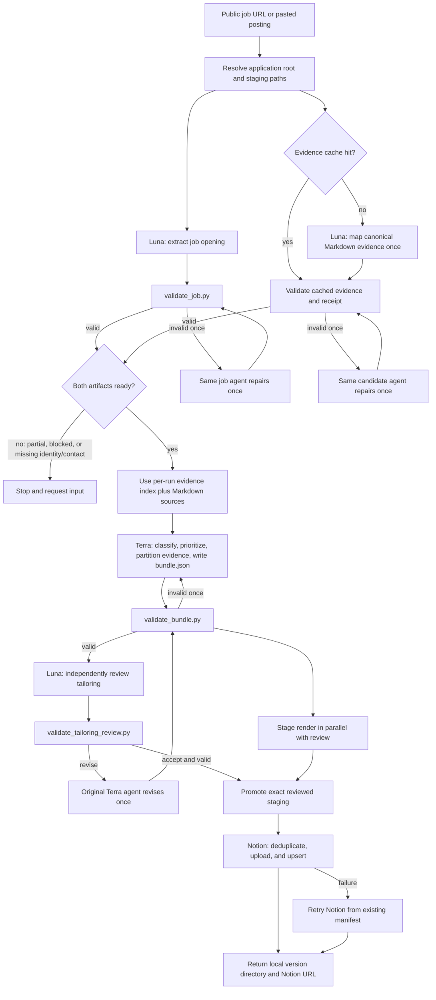

# Job Application Workflow

This document describes what happens after a public job link is supplied to
`$prepare-job-application`. It covers one opening only. The workflow prepares
and tracks an application; it never submits the application.

Each managed run also writes a local timing ledger under
`~/Documents/job-search/applications/.workflow-runs/`. The ledger records
timezone-aware start/end timestamps, elapsed milliseconds, retries, blockers,
and parallel groups for every coordinator, skill, validator, rendering, and
Notion stage. Active processing time is calculated as the union of active
intervals; explicit input/access waits are reported separately. Ledgers are
kept for successful, blocked, failed, and cancelled runs. Finalized ledgers
are checked for monotonic timestamps and duration consistency; failed checks
mark aggregate durations as untrusted.

Managed applications consume the canonical Markdown source manifest at
`~/Documents/job-search/sources/current.json`. The resolver verifies its live
hashes, and workers read the Markdown directly. A per-run evidence index is
derived only for compatibility with the existing bundle schema.

For unanswered applications, `$manage-job-applications` delegates to
`$requeue-unanswered-applications`. That skill uses `Generated At` as the card
age source for follow-up thresholds. `Applied At` remains the actual submission
timestamp; the two timestamps must not be interchanged. A normal board review
automatically moves `APPLIED` cards that are at least 14 whole local-calendar
days old to `REAPPLY`; an explicit preview, audit, or dry run remains read-only.

## At a glance

Job extraction, evidence-cache lookup/build, and rendering-tool preflight run
in parallel. After structural bundle validation, independent review and
temporary rendering also overlap. Managed runs reuse evidence only when its
complete canonical source fingerprint and receipt validate. Generated evidence
is never written into the canonical source folder.

## Ordered execution

| Order | Component | Input | Functionality | Expected result |
| --- | --- | --- | --- | --- |
| 1 | `prepare-job-application` | Public URL or pasted posting | Reads the workflow contract, resolves `~/Documents/job-search`, and creates one application/staging context. | A stable application root and absolute paths for all intermediate artifacts. |
| 2a | `$extract-job-opening` → Luna | Job URL or pasted text, job template | Retrieves exactly one public posting and writes the visible source plus normalized, evidence-backed job data. | `source.md` and `job.json`. |
| 2b | Candidate-evidence cache/worker | Canonical manifest fingerprint, Markdown sources, candidate-evidence template | Reuses a validated cache entry or maps unchanged Markdown once while holding the fingerprint lock. | Hash-keyed `candidate-evidence.json` and receipt. |
| 3a | `validate_job.py` | `job.json` | Checks schema, required fields, dates, source metadata, field evidence, and source hash. | Exit `0`: complete and ready; exit `1`: invalid; exit `2`: partial/blocked. |
| 3b | `validate_candidate_evidence.py` | `candidate-evidence.json` | Checks schema, candidate readiness, source paths and hashes, fact references, and timestamps. | Exit `0`: ready; exit `1`: invalid; exit `2`: not ready. |
| 4 | Same extraction agent, at most once | Exact validator errors | Repairs its own artifact without changing ownership or starting a replacement workflow. | A second validation attempt; unresolved failure stops tailoring. |
| 5 | `prepare-job-application` gate | Validated job and candidate artifacts | Joins both branches and checks that neither is partial/blocked and that candidate identity/contact evidence exists. | Tailoring may begin, with the absolute candidate-evidence path preserved. |
| 6 | Tailoring reuse handoff | `job.json`, per-run `candidate-evidence.json`, canonical Markdown directory | Passes the derived evidence index and Markdown context to Terra; canonical sources are never rewritten. | The exact per-run evidence path and source hashes are preserved. |
| 7 | Terra bundle-writing agent | Validated job, candidate evidence, bundle template, tailoring references | Classifies the job as computing/non-computing/mixed/unclear, derives job priorities, chooses document focus, partitions every candidate fact, and drafts the résumé, letter, and match analysis. | `bundle.json` with evidence-backed citations and selected/deprioritized partitions. |
| 8 | `validate_bundle.py` | `bundle.json` | Performs deterministic structural checks for schema, hashes, source references, evidence partition completeness, and citation bookkeeping. | Exit `0`: structurally ready for semantic review. |
| 9 | Terra repair, at most once | Exact bundle validation errors | Corrects structural issues in the original writing context. | A revalidated bundle or a stopped workflow. |
| 10 | Independent Luna review agent | Validated job, candidate evidence, bundle, review template | Judges job-family alignment, priority grounding, candidate relevance, focus compatibility, evidence-backed claims, and non-computing safeguards. | `tailoring-review.json` with `accept` or `revise`. |
| 11 | `validate_tailoring_review.py` | `tailoring-review.json` | Checks review schema, referenced artifact paths/hashes, and verdict consistency. | Exit `0` plus reviewer verdict `accept` is required. |
| 12 | Terra revision and fresh review, when needed | Review findings and current bundle | Applies one evidence-preserving revision, then repeats bundle validation and commissions a fresh review against the new bundle hash. | An independently accepted bundle or a stopped workflow. |
| 13 | `render_bundle.py --stage` | Structurally valid `bundle.json`, application root, rendering profile | Runs concurrently with semantic review and creates temporary PDFs, verified input artifacts, and deterministic page/text results without publishing a version. | Non-current staging directory. |
| 14 | `render_bundle.py --promote` | Staging directory and accepted review | Binds the review to the exact staged bundle, embeds its receipt/hash, and atomically creates schema-2 `vNNN` plus `current.json`. | Review-backed immutable local version. |
| 15 | `$notion-track-application` / Notion MCP | Local manifest and PDFs | Fetches the workspace, finds the exact database, deduplicates by canonical URL or source ID/company/role, uploads both PDFs concurrently after creating their targets, and upserts the record sequentially. | One synchronized `TO_APPLY` record with current document metadata. |
| 16 | Parent completion | Local version and Notion result | Returns the local path, generated artifacts, evidence gaps, Notion status, and page URL. | User can review the application and decide whether to submit it manually. |

## Agent responsibilities

### Parent coordinator: `prepare-job-application`

The parent owns orchestration, concurrency, path handoff, validation gates,
retry routing, staged rendering/promotion, and the final response. It does not make
semantic job or candidate decisions itself and is the only workflow participant
that accesses Notion.

### Luna job-extraction agent

This agent is responsible for retrieving one public posting and preserving the
visible posting text as evidence. It normalizes the posting into `job.json`,
including field-level evidence references, source type, source hash, extraction status,
and readiness warnings. It must not use credentials, bypass access controls,
crawl in bulk, or submit an application.

### Luna candidate-evidence agent

This agent is responsible for local candidate-document extraction. It preserves
original paths and hashes, assigns stable fact
IDs, and attaches evidence references to candidate fields and facts. It owns one
repair pass. Its artifact is caller-owned after validation and must not be
regenerated by tailoring.

### Terra bundle-writing agent

Terra makes the semantic tailoring decisions: job family, priorities, document
focus, evidence partition, résumé content, motivation letter, fit arguments,
and gaps. It may paraphrase supported facts but may not invent qualifications,
metrics, dates, tools, seniority, or domain experience.

### Luna independent reviewer

The reviewer is an independent semantic authority. It can reject a technically
valid bundle when the focus is wrong, the selected evidence is irrelevant, the
claims are unsupported, or a non-computing job is presented as software-first.

## Deterministic scripts versus semantic decisions

Scripts are integrity gates, not application strategists:

- `validate_job.py` checks the extracted job artifact.
- `validate_candidate_evidence.py` checks candidate evidence integrity and readiness.
- `validate_bundle.py` checks bundle structure and citation bookkeeping.
- `validate_tailoring_review.py` checks review-artifact integrity and consistency.
- `render_bundle.py` stages deterministic outputs and promotes only an exact independently accepted bundle.

These scripts do not decide job meaning, candidate relevance, document focus,
qualifications, matches, gaps, or prose quality. Those decisions belong to the
agents and the independent review gate.

## Failure and retry rules

- A partial or blocked job extraction never enters tailoring. Request pasted
  content or saved HTML when public content is inaccessible.
- Each extraction artifact gets one repair pass by its original agent.
- A caller-provided candidate artifact always takes precedence over local
  extraction during tailoring.
- A bundle validation failure gets one repair pass by the original Terra agent.
- A `revise` review causes one Terra revision, then structural validation and a
  fresh independent review against the new bundle hash.
- A résumé that exceeds the deterministic one-page limit fails staging and gets
  one evidence-preserving reduction followed by validation, review, and rendering.
- A Notion failure does not regenerate documents. Synchronization retries from
  the existing manifest and immutable version.
- Application submission, employer contact, and status `APPLIED` are outside
  this workflow unless separately requested and authorized.

## Completion contract

A successful run returns:

- The immutable application version directory under
  `applications/<company-slug>/<role-slug>/<job-id-or-url-hash>/vNNN/`.
- Résumé and motivation-letter PDFs, match analysis, manifest, and input
  evidence.
- Any evidence gaps or unsupported job requirements.
- Notion synchronization status and the deduplicated page URL.
