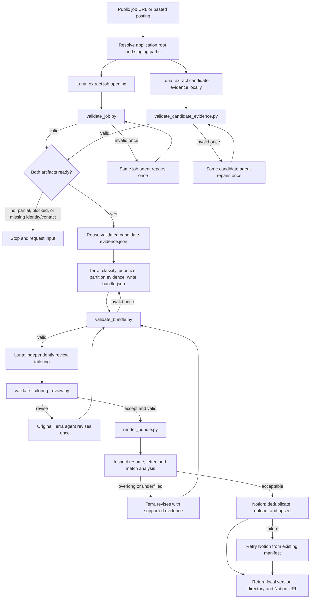

# Job Application Workflow

This document describes what happens after a public job link is supplied to
`$prepare-job-application`. It covers one opening only. The workflow prepares
and tracks an application; it never submits the application.

For unanswered applications, `$manage-job-applications` delegates to
`$requeue-unanswered-applications`. That skill uses `Generated At` as the card
age source for follow-up thresholds. `Applied At` remains the actual submission
timestamp; the two timestamps must not be interchanged. A normal board review
automatically moves `APPLIED` cards that are at least 14 whole local-calendar
days old to `REAPPLY`; an explicit preview, audit, or dry run remains read-only.

## At a glance

The two Luna extraction workers and local rendering-tool preflight can run in
parallel. Everything after their validated outputs is dependency-ordered.
Candidate evidence is extracted once for this workflow and passed unchanged
into tailoring. A same-run validation receipt avoids rehashing the candidate
source corpus; a stale or missing receipt triggers full validation.

## Ordered execution

| Order | Component | Input | Functionality | Expected result |
| --- | --- | --- | --- | --- |
| 1 | `prepare-job-application` | Public URL or pasted posting | Reads the workflow contract, resolves `~/Documents/job-search`, and creates one application/staging context. | A stable application root and absolute paths for all intermediate artifacts. |
| 2a | `$extract-job-opening` → Luna | Job URL or pasted text, job template | Retrieves exactly one public posting and writes the visible source plus normalized, evidence-backed job data. | `source.md` and `job.json`. |
| 2b | Candidate-evidence Luna worker | Local curated candidate sources, candidate-evidence template | Reads local documents, creates text snapshots and hashes, normalizes identity/contact data, and maps claims to exact quotations. | `candidate-evidence.json`, source snapshots, hashes, and a validation receipt. |
| 3a | `validate_job.py` | `job.json` | Checks schema, required fields, dates, source metadata, field evidence, and source hash. | Exit `0`: complete and ready; exit `1`: invalid; exit `2`: partial/blocked. |
| 3b | `validate_candidate_evidence.py` | `candidate-evidence.json` | Checks schema, candidate readiness, source/snapshot paths and hashes, quotations, fact references, and timestamps. | Exit `0`: ready; exit `1`: invalid; exit `2`: not ready. |
| 4 | Same extraction agent, at most once | Exact validator errors | Repairs its own artifact without changing ownership or starting a replacement workflow. | A second validation attempt; unresolved failure stops tailoring. |
| 5 | `prepare-job-application` gate | Validated job and candidate artifacts | Joins both branches and checks that neither is partial/blocked and that candidate identity/contact evidence exists. | Tailoring may begin, with the absolute candidate-evidence path preserved. |
| 6 | Tailoring reuse handoff | `job.json`, validated `candidate-evidence.json`, receipt | Verifies a matching same-run receipt when possible, falls back to full validation when needed, and forbids rescanning sources, recreating snapshots, or spawning another candidate-evidence worker. | The exact candidate-evidence path is passed to Terra and its hashes are preserved. |
| 7 | Terra bundle-writing agent | Validated job, candidate evidence, bundle template, tailoring references | Classifies the job as computing/non-computing/mixed/unclear, derives job priorities, chooses document focus, partitions every candidate fact, and drafts the résumé, letter, and match analysis. | `bundle.json` with evidence-backed citations and selected/deprioritized partitions. |
| 8 | `validate_bundle.py` | `bundle.json` | Performs deterministic structural checks for schema, hashes, source references, evidence partition completeness, and citation bookkeeping. | Exit `0`: structurally ready for semantic review. |
| 9 | Terra repair, at most once | Exact bundle validation errors | Corrects structural issues in the original writing context. | A revalidated bundle or a stopped workflow. |
| 10 | Independent Luna review agent | Validated job, candidate evidence, bundle, review template | Judges job-family alignment, priority grounding, candidate relevance, focus compatibility, evidence-backed claims, and non-computing safeguards. | `tailoring-review.json` with `accept` or `revise`. |
| 11 | `validate_tailoring_review.py` | `tailoring-review.json` | Checks review schema, referenced artifact paths/hashes, and verdict consistency. | Exit `0` plus reviewer verdict `accept` is required. |
| 12 | Terra revision and fresh review, when needed | Review findings and current bundle | Applies one evidence-preserving revision, then repeats bundle validation and commissions a fresh review against the new bundle hash. | An independently accepted bundle or a stopped workflow. |
| 13 | Render-tool preflight + `render_bundle.py` | Accepted `bundle.json`, application root, rendering profile | Checks rendering tools early, then deterministically creates the résumé and letter source files/PDFs, exact input snapshots, hashes, manifest, immutable `vNNN`, and `current.json` without generating an unused PNG preview. | A new immutable local application version. |
| 14 | Parent visual inspection | Rendered résumé PDF, letter PDF, `match-analysis.md` | Checks every page, résumé length, visual balance, and strategy output. | Acceptable artifacts, or one supported reduction/expansion revision followed by fresh validation, review, and rendering. |
| 15 | `$notion-track-application` / Notion MCP | Local manifest and PDFs | Fetches the workspace, finds the exact database, deduplicates by canonical URL or source ID/company/role, uploads both PDFs concurrently after creating their targets, and upserts the record sequentially. | One synchronized `TO_APPLY` record with current document metadata. |
| 16 | Parent completion | Local version and Notion result | Returns the local path, generated artifacts, evidence gaps, Notion status, and page URL. | User can review the application and decide whether to submit it manually. |

## Agent responsibilities

### Parent coordinator: `prepare-job-application`

The parent owns orchestration, concurrency, path handoff, validation gates,
retry routing, rendering inspection, and the final response. It does not make
semantic job or candidate decisions itself and is the only workflow participant
that accesses Notion.

### Luna job-extraction agent

This agent is responsible for retrieving one public posting and preserving the
visible posting text as evidence. It normalizes the posting into `job.json`,
including field-level quotations, source type, source hash, extraction status,
and readiness warnings. It must not use credentials, bypass access controls,
crawl in bulk, or submit an application.

### Luna candidate-evidence agent

This agent is responsible for local candidate-document extraction. It preserves
original paths and hashes, creates UTF-8 text snapshots, assigns stable fact
IDs, and attaches exact quotations to candidate fields and facts. It owns one
repair pass. Its artifact is caller-owned after validation and must not be
regenerated by tailoring.

### Terra bundle-writing agent

Terra makes the semantic tailoring decisions: job family, priorities, document
focus, evidence partition, résumé content, motivation letter, fit arguments,
and gaps. It may paraphrase supported facts but may not invent qualifications,
metrics, dates, tools, seniority, or domain experience.

### Luna independent reviewer

The reviewer is an independent semantic authority. It can reject a technically
valid bundle when the focus is wrong, the selected evidence is irrelevant, the
claims are unsupported, or a non-computing job is presented as software-first.

## Deterministic scripts versus semantic decisions

Scripts are integrity gates, not application strategists:

- `validate_job.py` checks the extracted job artifact.
- `validate_candidate_evidence.py` checks candidate evidence integrity and readiness.
- `validate_bundle.py` checks bundle structure and citation bookkeeping.
- `validate_tailoring_review.py` checks review-artifact integrity and consistency.
- `render_bundle.py` creates immutable outputs, hashes, manifests, and pointers.

These scripts do not decide job meaning, candidate relevance, document focus,
qualifications, matches, gaps, or prose quality. Those decisions belong to the
agents and the independent review gate.

## Failure and retry rules

- A partial or blocked job extraction never enters tailoring. Request pasted
  content or saved HTML when public content is inaccessible.
- Each extraction artifact gets one repair pass by its original agent.
- A caller-provided candidate artifact always takes precedence over local
  extraction during tailoring.
- A bundle validation failure gets one repair pass by the original Terra agent.
- A `revise` review causes one Terra revision, then structural validation and a
  fresh independent review against the new bundle hash.
- An overlong or visibly underfilled résumé gets one evidence-preserving content
  revision, followed by the full validation/review/render cycle.
- A Notion failure does not regenerate documents. Synchronization retries from
  the existing manifest and immutable version.
- Application submission, employer contact, and status `APPLIED` are outside
  this workflow unless separately requested and authorized.

## Completion contract

A successful run returns:

- The immutable application version directory under
  `applications/<company-slug>/<role-slug>/<job-id-or-url-hash>/vNNN/`.
- Résumé and motivation-letter PDFs, match analysis, manifest, and input
  snapshots.
- Any evidence gaps or unsupported job requirements.
- Notion synchronization status and the deduplicated page URL.
