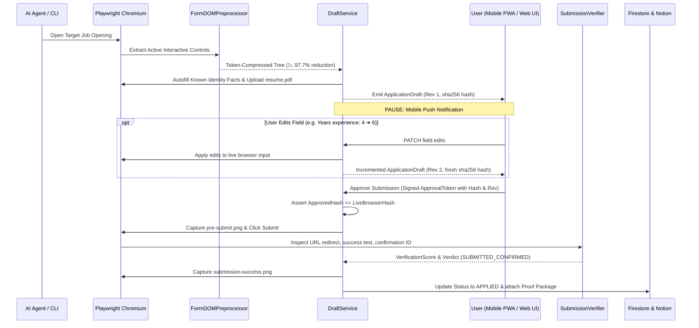

# Playwright Auto-Apply Engine & Human-in-the-Loop Architecture

The **Auto-Apply Engine** (`job_application_agents/auto_apply`) automates the filling, PDF attachment, mobile/web review, and multi-signal submission verification for employer job applications.

---

## 1. Decoupled Human-in-the-Loop Lifecycle

---

## 2. Core Subsystem Modules

| Module | Responsibility |
|---|---|
| [`draft_models.py`](file:///home/falluba/job-application-agents/job_application_agents/auto_apply/draft_models.py) | `ApplicationDraft`, `ApplicationField`, `ApprovalToken`, `VerificationScore`, `FieldSource`, `ApplicationState`. |
| [`preprocessor.py`](file:///home/falluba/job-application-agents/job_application_agents/auto_apply/preprocessor.py) | `FormDOMPreprocessor` compressing raw HTML pages into token-efficient JSON form trees (<500 tokens). |
| [`draft_service.py`](file:///home/falluba/job-application-agents/job_application_agents/auto_apply/draft_service.py) | `DraftService` managing draft extraction, revision increments, cryptographic lock enforcement, and proof archiving. |
| [`verifier.py`](file:///home/falluba/job-application-agents/job_application_agents/auto_apply/verifier.py) | `SubmissionVerifier` running multi-signal verification scoring across redirect URLs, DOM text, and confirmation IDs. |
| [`service.py`](file:///home/falluba/job-application-agents/job_application_agents/auto_apply/service.py) | `AutoApplyService` transparent browser lifecycle coordinator with supervised review and clickable document links. |
| [`scripts/draft_review.py`](file:///home/falluba/job-application-agents/scripts/draft_review.py) | Terminal TUI and local web review dashboard (`http://127.0.0.1:8765`) for 1-click mobile/desktop draft approvals. |

---

## 3. Key Architectural Guardrails

1. **No Blind Submissions**:
   - Submissions require an explicit `ApprovalToken` containing the exact `revision` number and cryptographic `draft_hash` (SHA-256).
   - If live form inputs diverge after approval, submission is halted.

2. **Never Blindly Retry Uncertain Submissions**:
   - If network drops or confirmation DOM cannot be verified, status transitions to `SUBMISSION_UNCERTAIN`.
   - The engine **never retries blindly**, preventing duplicate employer submissions.

3. **Complete Proof Package**:
   - Every submission automatically saves:
     - `pre-submit.png`: Exact state of all form fields before click.
     - `submission-success.png`: Confirmation screen.
     - `proof-package.json`: Form answers, confirmation ID, verification score, timestamps, and resume path.

4. **Respect Portal Boundaries**:
   - Dry-run is the default. Submission additionally requires the exact
     `JAA_ENABLE_SUBMISSION=I_UNDERSTAND_SUBMISSION` deployment gate, an
     explicit CLI opt-in, and interactive confirmation. Authentication walls,
     CAPTCHAs, and access restrictions are handed back to the candidate.
