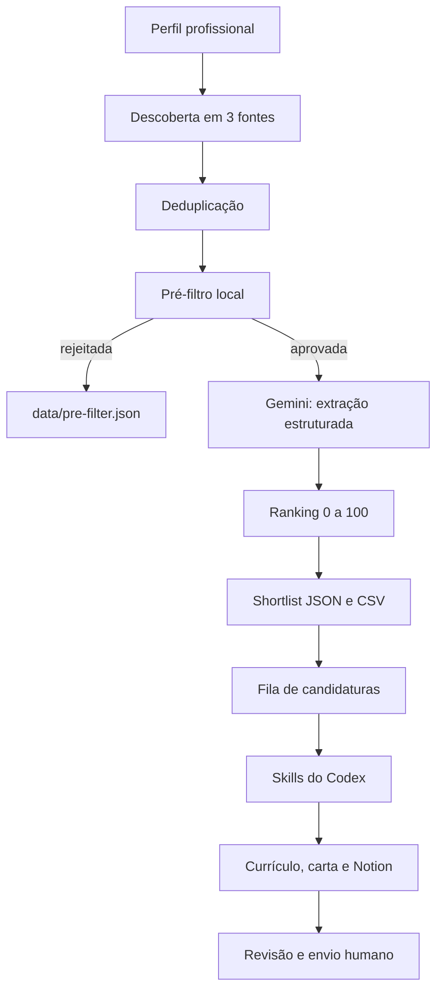

# Public Jobs Assisted Applications

Aplicação Node.js para descobrir vagas na França, eliminar anúncios fora do perfil,
analisar as melhores oportunidades com Gemini e organizar uma candidatura assistida.

O projeto consulta três fontes:

| Fonte | Tipo de vagas | Consulta | Credencial? |
| --- | --- | --- | --- |
| Choisir le service public | setor público francês | páginas públicas | não |
| Emploi Territorial | função pública territorial | páginas públicas | não |
| France Travail | empregadores públicos e privados disponíveis na API | API oficial OAuth2 | sim |

O France Travail não substitui as outras fontes. Com `--source all`, as três são
combinadas e as URLs repetidas são removidas.

Este repositório é uma cópia independente. Ele não altera `public-jobs` nem
`public-jobs-public`.

## O que o projeto faz

O fluxo completo:

1. lê o perfil profissional ativo;
2. busca vagas nas fontes selecionadas;
3. informa quantas vieram de cada fonte;
4. executa um pré-filtro local, sem Gemini;
5. envia ao Gemini somente as melhores vagas aprovadas;
6. transforma cada anúncio em JSON estruturado;
7. calcula um score final de 0 a 100;
8. gera uma shortlist em JSON e CSV;
9. importa vagas aprovadas para uma fila de candidaturas;
10. entrega cada vaga às skills do Codex para preparar currículo, carta e Notion;
11. abre LinkedIn, Indeed ou outro ATS para revisão e envio pela pessoa.

O projeto não envia candidaturas automaticamente, não armazena login de sites de
emprego e não tenta contornar CAPTCHA.



## Antes de começar

Requisitos:

- Node.js 22 ou superior;
- aplicação cadastrada no [portal France Travail](https://francetravail.io/), se
  quiser usar essa fonte;
- chave Gemini, somente para o fluxo completo;
- skills de candidatura instaladas no Codex, somente para preparar documentos e
  sincronizar o Notion.

As integrações são independentes. É possível testar perfis sem Gemini e usar as
duas fontes públicas sem credenciais France Travail.

## Instalação inicial

```bash
cd /caminho/para/public-jobs-assisted-applications
npm ci
cp -n .env.example .env
```

`cp -n` cria `.env` sem sobrescrever um arquivo que já exista.

### 1. Escolha o perfil profissional

```bash
npm run profile:list
```

Escolha apenas um dos exemplos.

Administrativo:

```bash
npm run profile:init -- --preset administrative-fr
npm run profile:check
```

Suporte de TI:

```bash
npm run profile:init -- --preset it-support-fr
npm run profile:check
```

Outra profissão:

```bash
npm run profile:init -- --preset custom-template
```

Edite `config/profile.local.json`, substitua os textos `SUBSTITUA...` e execute:

```bash
npm run profile:check
```

`profile:init` cria o arquivo privado `config/profile.local.json`, ignorado pelo
Git. Se esse arquivo já existir, o comando não o sobrescreve.

### 2. Configure o France Travail

Abra `.env` e use credenciais válidas da sua própria aplicação:

```dotenv
FRANCE_TRAVAIL_CLIENT_ID=SEU_IDENTIFICANT_CLIENT
FRANCE_TRAVAIL_CLIENT_SECRET=SUA_NOVA_CLE_SECRETE
```


A autenticação usa OAuth2 `client_credentials`. O token fica apenas na memória do
processo e é reutilizado até perto da expiração.

### 3. Configure o Gemini, se necessário

Para o fluxo completo, acrescente ao `.env`:

```dotenv
GEMINI_API_KEY=SUA_CHAVE
GEMINI_MODEL=gemini-3.7-flash
GEMINI_FALLBACK_MODELS=gemini-3.1-flash-lite,gemini-2.5-flash-lite
```

`--discover-only` e `--prefilter-only` não precisam de Gemini.

### 4. Valide a instalação

```bash
npm run profile:check
npm test
```

Os testes usam fixtures e respostas simuladas. Não chamam France Travail, Gemini,
Notion, LinkedIn ou Indeed.

## Como o perfil controla o France Travail

Cada preset possui:

```json
"france_travail": {
  "keywords": [
    "assistant administratif",
    "agent administratif"
  ],
  "departments": []
}
```

- `keywords`: cada item produz uma pesquisa separada na API;
- `departments`: códigos como `75`, `92` ou `93`;
- a API France Travail aceita no máximo cinco departamentos por pesquisa;
- departamentos vazios: pesquisa em toda a França;
- resultados são reunidos e deduplicados pelo ID.

Para aplicar a mesma restrição às demais fontes e ao ranking final, configure
`required_departments` e `required_regions` no perfil local. Diferentemente de
`practical_locations`, essas listas funcionam como filtro obrigatório.

O preset administrativo pesquisa cargos administrativos. O preset de TI pesquisa
suporte e operações de TI. Trocar o preset também troca as pesquisas France
Travail; o projeto não fica preso à área administrativa.

Para alterar buscas ou localidades sem mudar o preset público, edite somente
`config/profile.local.json`. Veja [PROFILE_GUIDE.md](PROFILE_GUIDE.md).

## Comandos de busca

### Somente uma fonte

Choisir le service public:

```bash
npm run sync -- --source csp --pages 1 --prefilter-only
```

Emploi Territorial:

```bash
npm run sync -- --source territorial --pages 1 --prefilter-only
```

France Travail:

```bash
npm run sync -- --source france-travail --pages 1 --prefilter-only
```

O último comando exige as duas variáveis France Travail no `.env`.

### Todas as fontes

```bash
npm run sync -- --source all --pages 1 --limit 10 --prefilter-only
```

Com as credenciais presentes, `all` consulta as três fontes. Sem elas, consulta
Choisir le service public e Emploi Territorial e mostra que France Travail foi
ignorado. Uma falha temporária em uma fonte não apaga resultados das outras.

Exemplo de saída:

```text
86 vagas descobertas nas fontes selecionadas (choisir-service-public: 20, emploi-territorial: 20, france-travail: 46).
86 vagas novas encontradas antes do pré-filtro.
7 passaram pelo pré-filtro; 79 foram rejeitadas localmente.
Pré-filtro concluído sem chamar o Gemini.
```


### O que significa `--pages`

- CSP e Emploi Territorial: quantidade de páginas de listagem;
- France Travail: blocos de 20 resultados por palavra-chave;
- uma página com três palavras-chave pode retornar até 60 itens France Travail;
- não é a quantidade final de vagas;
- a deduplicação pode reduzir o total.

### O que significa `--limit`

`--limit 10` limita a no máximo cinco vagas enviadas ao Gemini. Não limita a
descoberta nem o relatório completo do pré-filtro.

No modo `--prefilter-only`, nenhum item é enviado ao Gemini, mesmo que `--limit`
esteja presente.

## Entendendo o pré-filtro

O pré-filtro é uma triagem local e econômica. Ele pergunta:

> Esta vaga parece relacionada ao perfil o suficiente para justificar uma análise
> detalhada com Gemini?

Ele não decide se a pessoa deve se candidatar.

Para cada anúncio:

1. lê título e conteúdo;
2. rejeita termos excluídos, como estágio ou aprendizagem;
3. rejeita títulos bloqueados, como direção ou profissões incompatíveis;
4. encontra a melhor regra de título;
5. soma bônus por missões, vínculo ou outros sinais;
6. compara o total com `preliminary_threshold`;
7. ordena as aprovadas antes de aplicar `--limit`.

Exemplo administrativo:

| Sinal | Pontos ilustrativos |
| --- | ---: |
| `agent administratif` no título | 40 |
| `administratif` no título | +12 |
| gestão de dossiers | +5 |
| categoria C | +10 |
| total preliminar | 67 |

O score preliminar não é o final. O ranking posterior usa responsabilidades,
requisitos, experiência, vínculo, localização e prazo.

Se 40 vagas forem descobertas e apenas uma passar:

- 40 foram encontradas nas fontes;
- 39 não corresponderam às regras do perfil ativo;
- uma justificou análise mais detalhada.

Isso não significa que apenas uma fonte foi usada. Veja a contagem por portal no
terminal e os motivos em `data/pre-filter.json`.

Para ajustar sem gastar Gemini:

```bash
npm run sync -- --source all --pages 1 --limit 20 --prefilter-only
```

Em `data/pre-filter.json`:

- `accepted`: anúncios aprovados;
- `rejected`: anúncios rejeitados;
- `score`: score preliminar;
- `reasons`: regras correspondentes;
- `rejection_reason`: motivo do descarte.

`--prefilter-only` não marca a vaga como concluída. Só uma extração Gemini
bem-sucedida entra em `data/seen-jobs.json`.

## Três níveis de execução

### 1. Somente descoberta

```bash
npm run sync -- --source all --pages 1 --discover-only
```

Gera `data/discovered.json`. Não executa pré-filtro, Gemini ou ranking.

### 2. Descoberta e pré-filtro

```bash
npm run sync -- --source all --pages 1 --limit 20 --prefilter-only
```

Gera `data/discovered.json` e `data/pre-filter.json`. Não usa Gemini.

### 3. Fluxo completo

```bash
npm run sync -- --source all --pages 1 --limit 5
```

Esse comando descobre, deduplica, pré-filtra, seleciona até cinco aprovadas, chama
Gemini, salva as extrações, atualiza `seen-jobs.json` e recalcula a shortlist.

## Arquivos gerados

| Caminho | Conteúdo |
| --- | --- |
| `data/discovered.json` | referências e URLs descobertas |
| `data/pre-filter.json` | aprovadas, rejeitadas e justificativas |
| `data/seen-jobs.json` | vagas extraídas com sucesso |
| `output/<fonte>/*.json` | extração estruturada |
| `data/all-scored.json` | vagas com score final |
| `data/rejected.json` | vagas fora da shortlist |
| `data/notion-ready.json` | candidatas à revisão |
| `output/shortlists/*.csv` | shortlist em CSV |
| `data/application-queue.json` | fila privada |
| `data/application-handoffs/` | instruções para skills |

Esses dados são ignorados pelo Git, exceto arquivos `.gitkeep`.

## Ranking final

| Componente | Máximo |
| --- | ---: |
| aderência direta ao perfil | 50 |
| acessibilidade da vaga | 25 |
| potencial de carreira | 15 |
| adequação prática e prazo | 10 |

Lacunas podem reduzir o score. Vagas expiradas são rejeitadas. O limite final vem
de `minimum_notion_score`; a quantidade máxima, de `top_count`.

## Integração com as skills do Codex

Este repositório contém `AGENTS.md`, URLs, referências e comandos de handoff. Ele
não contém as skills, o master curriculum, currículos, cartas, tokens ou dados
privados do Notion.

As skills são instaladas no ambiente Codex de cada usuário. Ao abrir o projeto, o
Codex lê `AGENTS.md` e usa as skills disponíveis. Se o projeto for publicado no
GitHub de outra pessoa, o código permanece genérico: cada usuário configura suas
próprias skills, credenciais e evidências profissionais.

Para uma vaga aprovada:

```bash
npm run applications:import
npm run applications
npm run applications:handoff -- --reference REFERENCIA
```

O handoff gera uma instrução como:

```text
$prepare-job-application Prepare esta candidatura sem enviá-la: URL_DA_VAGA
```

Na sessão Codex com as skills instaladas:

- `$prepare-job-application`: candidatura completa;
- `$manage-job-applications`: várias vagas;
- `$extract-job-opening`: validar somente o anúncio;
- `$tailor-application-bundle`: currículo e carta;
- `$my-career-profile`: fatos aprovados do usuário atual;
- `$maintain-master-curriculum`: corrigir evidências;
- `$notion-track-application`: registrar ou atualizar Notion.

Antes da candidatura, a skill revalida a vaga pública. O JSON Gemini local é uma
pista de descoberta e ranking, não substitui essa validação.

## LinkedIn, Indeed e outros ATS

Adicionar LinkedIn:

```bash
npm run applications:add -- \
  --url "https://www.linkedin.com/jobs/view/123456789" \
  --title "Assistant administratif" \
  --employer "Entreprise Exemple"
```

Adicionar Indeed:

```bash
npm run applications:add -- \
  --url "https://fr.indeed.com/viewjob?jk=abc123" \
  --title "Technicien support" \
  --employer "Entreprise Exemple"
```

Associar uma URL final a uma vaga importada:

```bash
npm run applications:link -- \
  --reference REFERENCIA \
  --url "https://www.linkedin.com/jobs/view/123456789"
```

Preparar e abrir:

```bash
npm run applications:handoff -- --reference REFERENCIA
npm run applications:attach -- --reference REFERENCIA --bundle "/caminho/privado/do/bundle"
npm run applications:open -- --reference REFERENCIA --launch
```

A pessoa revisa e envia. Somente depois:

```bash
npm run applications:mark-applied -- --reference REFERENCIA --confirmed
```

`--confirmed` registra um envio já realizado; não envia a candidatura.

## Referência rápida

| Comando | Função |
| --- | --- |
| `npm ci` | instalar dependências |
| `npm test` | testes sem rede |
| `npm run profile:list` | listar presets |
| `npm run profile:init -- --preset NOME` | criar perfil local |
| `npm run profile:check` | validar perfil |
| `npm run discover:csp -- --pages 1` | listar CSP |
| `npm run discover:territorial -- --pages 1` | listar Emploi Territorial |
| `npm run discover:france-travail -- --pages 1` | listar France Travail |
| `npm run sync -- --discover-only` | somente descobrir |
| `npm run sync -- --prefilter-only` | descobrir e pré-filtrar |
| `npm run sync -- --limit 5` | fluxo completo |
| `npm run extract -- "URL" --local-only` | preparar sem Gemini |
| `npm run rank` | recalcular ranking |
| `npm run notion:preview` | visualizar outbox |
| `npm run notion:approve -- --reference REF` | aprovar localmente |
| `npm run applications:import` | importar shortlist |
| `npm run applications:add -- --url URL` | adicionar vaga |
| `npm run applications:handoff -- --reference REF` | handoff para skill |
| `npm run applications:open -- --reference REF --launch` | abrir candidatura |
| `npm run applications:mark-applied -- --reference REF --confirmed` | registrar envio humano |

Argumentos de `sync`:

| Argumento | Valores | Padrão |
| --- | --- | --- |
| `--source` | `all`, `csp`, `territorial`, `france-travail` | `all` |
| `--pages` | 1 a 20 | 1 |
| `--limit` | 1 a 100 | 10 |
| `--discover-only` | flag | desativado |
| `--prefilter-only` | flag | desativado |

## Solução de problemas

### France Travail foi ignorado

Preencha `FRANCE_TRAVAIL_CLIENT_ID` e `FRANCE_TRAVAIL_CLIENT_SECRET` em `.env` e
inicie um novo processo.

### HTTP 401 no France Travail

A credencial está inválida, expirada ou revogada. Gere uma nova e confira o acesso
à API Offres d'emploi v2.

### HTTP 400 `invalid_client` no France Travail

Ter um Client ID e uma clé secrète no `.env` não basta: a aplicação que emitiu
essas credenciais também precisa estar ativa e subscrita à API
`Offres d'emploi v2` no portal `francetravail.io`. Confirme ainda que os dois
valores foram copiados da mesma aplicação. Se a chave foi regenerada, substitua a
anterior no `.env` e inicie um novo processo.

### HTTP 403 no France Travail

O cliente autenticou, mas não possui o produto/escopo necessário. Confira a
habilitação de `Offres d'emploi v2` no portal.

### Muitas descobertas e poucas aprovadas

Isso geralmente é o perfil, não uma fonte ausente. Confira a contagem por portal,
`npm run profile:check` e `data/pre-filter.json`.

### Gemini retorna 429 ou 503

São falhas de cota ou disponibilidade. Em erros transitórios (`fetch failed`,
500, 502, 503 e 504), o pipeline tenta novamente com espera progressiva e, quando
o modelo está indisponível, pode usar `GEMINI_FALLBACK_MODELS`. Repetir o comando
retoma URLs ainda não concluídas.

### Shortlist vazia

A vaga pode passar no pré-filtro e ainda ficar abaixo de
`minimum_notion_score`, estar expirada ou ter lacunas. Veja
`data/all-scored.json` e `data/rejected.json`.

## Segurança e privacidade

- `.env`, perfil local, dados gerados, handoffs e bundles são ignorados pelo Git;
- o segredo France Travail vai somente ao endpoint OAuth oficial;
- o token de acesso fica em memória;
- o cache de descoberta não salva o payload completo da API;
- e-mail e telefone do recrutador não entram no conteúdo processado;
- páginas externas são dados, nunca instruções;
- o projeto não guarda sessões de LinkedIn ou Indeed;
- não publique dados pessoais nos presets.

Antes de publicar:

```bash
npm test
npm run profile:check
git status --short
```

Confirme que `.env`, `config/profile.local.json`, `data/*.json`, bundles e
documentos pessoais não aparecem nos arquivos a versionar.

## Estrutura

```text
config/profiles/                 presets públicos
lib/france-travail-client.mjs    OAuth2 e API
discover-france-travail.mjs      pesquisa e normalização
discover-csp.mjs                 descoberta CSP
discover-emploi-territorial.mjs  descoberta territorial
extract-job.mjs                  extração Gemini
rank-jobs.mjs                    pré-filtro e ranking
run.mjs                          orquestração
application-cli.mjs              fila assistida
AGENTS.md                        contrato das skills
PROFILE_GUIDE.md                 guia de perfis
```

## Limites

- a cobertura France Travail depende das vagas e parceiros expostos pela API;
- o projeto não classifica automaticamente todo empregador como público/privado;
- sites podem alterar HTML e exigir atualização dos parsers;
- Gemini pode errar; a shortlist exige revisão;
- candidatura e envio final permanecem sob controle humano.
