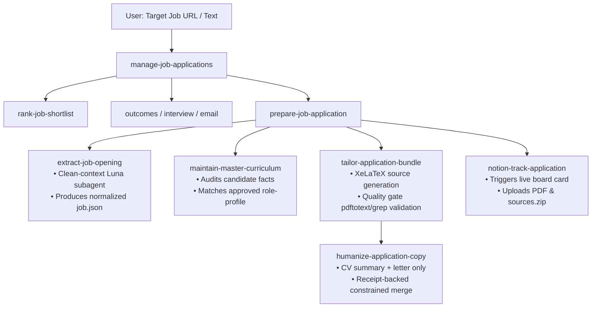

# Agent Skills & Orchestration Architecture

The **Agent Skills Subsystem** (`skills/`) contains specialized prompt-engineered capabilities that enable Codex and its clean-context workers to orchestrate end-to-end job applications with strict truthfulness, quality gates, and evidence verification.

---

## 1. Agent Skill Pipeline

---

## 2. Skill Inventory

| Skill | Directory | Core Function |
|---|---|---|
| **`prepare-job-application`** | [`skills/prepare-job-application`](file:///home/falluba/job-application-agents/skills/prepare-job-application/SKILL.md) | Master orchestrator coordinating extraction, role matching, document generation, and tracking. |
| **`extract-job-opening`** | [`skills/extract-job-opening`](file:///home/falluba/job-application-agents/skills/extract-job-opening/SKILL.md) | Retrieves public postings into Schema v2 `job.json` and verbatim `source.md`. |
| **`maintain-master-curriculum`** | [`skills/maintain-master-curriculum`](file:///home/falluba/job-application-agents/skills/maintain-master-curriculum/SKILL.md) | Manages canonical markdown evidence library and evidence-backed role profiles. |
| **`tailor-application-bundle`** | [`skills/tailor-application-bundle`](file:///home/falluba/job-application-agents/skills/tailor-application-bundle/SKILL.md) | Produces tailored resume/letter `.tex` sources, validates compile quality, and emits match analysis. |
| **`humanize-application-copy`** | [`skills/humanize-application-copy`](file:///home/falluba/job-application-agents/skills/humanize-application-copy/SKILL.md) | Humanizes only the CV profile summary and motivation-letter paragraphs with receipt-backed constrained rewrites. |
| **`notion-track-application`** | [`skills/notion-track-application`](file:///home/falluba/job-application-agents/skills/notion-track-application/SKILL.md) | Creates and updates live Kanban cards on Notion with attached PDFs. |
| **`manage-job-applications`** | [`skills/manage-job-applications`](file:///home/falluba/job-application-agents/skills/manage-job-applications/SKILL.md) | Coordinates multiple applications, reviews boards, and delegates worker tasks. |
| **`automate-job-application`** | [`skills/automate-job-application`](file:///home/falluba/job-application-agents/skills/automate-job-application/SKILL.md) | Token-optimized DOM inspection and safe, gated form review. |
| **`add-latex-template`** | [`skills/add-latex-template`](file:///home/falluba/job-application-agents/skills/add-latex-template/SKILL.md) | Adapts and installs XeLaTeX résumé templates for dynamic slot rendering. |
| **`onboard-job-search`** | [`skills/onboard-job-search`](file:///home/falluba/job-application-agents/skills/onboard-job-search/SKILL.md) | Sets up evidence-backed candidate facts and search preferences. |
| **`rank-job-shortlist`** | [`skills/rank-job-shortlist`](file:///home/falluba/job-application-agents/skills/rank-job-shortlist/SKILL.md) | Batch-scores, deduplicates, and prioritizes public openings. |
| **`track-application-outcome`** | [`skills/track-application-outcome`](file:///home/falluba/job-application-agents/skills/track-application-outcome/SKILL.md) | Records lifecycle events and drafts follow-ups. |
| **`sync-application-email`** | [`skills/sync-application-email`](file:///home/falluba/job-application-agents/skills/sync-application-email/SKILL.md) | Proposes source-cited email status updates. |
| **`prepare-interview`** | [`skills/prepare-interview`](file:///home/falluba/job-application-agents/skills/prepare-interview/SKILL.md) | Builds stage-specific interview preparation. |
| **`expand-candidate-profile`** | [`skills/expand-candidate-profile`](file:///home/falluba/job-application-agents/skills/expand-candidate-profile/SKILL.md) | Finds additive evidence in supplied and linked sources. |
| **`plan-upskilling`** | [`skills/plan-upskilling`](file:///home/falluba/job-application-agents/skills/plan-upskilling/SKILL.md) | Converts recurring job gaps into a learning plan. |
| **`generate-application-report`** | [`skills/generate-application-report`](file:///home/falluba/job-application-agents/skills/generate-application-report/SKILL.md) | Produces a derived offline HTML dashboard. |
| **`sync-job-pipeline-view`** | [`skills/sync-job-pipeline-view`](file:///home/falluba/job-application-agents/skills/sync-job-pipeline-view/SKILL.md) | Publishes a one-way Notion presentation view. |
| **`add-job-portal`** | [`skills/add-job-portal`](file:///home/falluba/job-application-agents/skills/add-job-portal/SKILL.md) | Generates public market-specific portal adapters. |

---

## 3. Strict Truthfulness & Quality Rules
1. **Never Invent Candidate Facts**: All statements in resumes and letters must be strictly backed by master curriculum evidence files.
2. **Deterministic Quality Gates**: Compiled documents are verified via `pdftotext` and keyword assertions before tracking.
3. **Hands-off by Default**: The pipeline prepares editable application packages and does not invoke auto-apply, enqueue submission jobs, or promote `APPLIED`. Submission tooling is separately gated by explicit deployment configuration and interactive confirmation.
